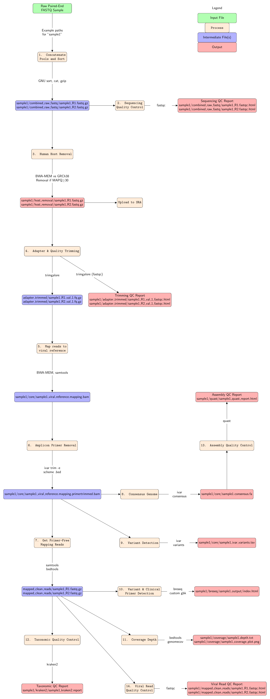

## Pipeline walkthrough

- For convenience in validating the pipeline, we list all shell commands
    executed by the pipeline below (cut-and-pasted from `snakemake -np`).

- This is for a running example with the following input files:
```
        fastq_inputs/MT-swab-Iran-Liverpool-pool1_S3_L001_R1_001.fastq.gz
        fastq_inputs/MT-swab-Iran-Liverpool-pool1_S3_L001_R2_001.fastq.gz
        fastq_inputs/MT-swab-Iran-Liverpool-pool2_S7_L001_R1_001.fastq.gz
        fastq_inputs/MT-swab-Iran-Liverpool-pool2_S7_L001_R2_001.fastq.gz
```

- Numbering of pipeline stages follows the following diagram.



### 1. Concatenate and sort R1 and R2 reads
```
        zcat -f sample1/data/MT-swab-Iran-Liverpool-pool1_S3_L001_R1_001.fastq.gz \
	     sample1/data/MT-swab-Iran-Liverpool-pool2_S7_L001_R1_001.fastq.gz \
	| paste - - - - \
	| sort -k1,1 -t " " \
	| tr "\t" "\n" \
	| gzip \
	> sample1/combined_raw_fastq/R1.fastq.gz

        zcat -f sample1/data/MT-swab-Iran-Liverpool-pool1_S3_L001_R2_001.fastq.gz \
	     sample1/data/MT-swab-Iran-Liverpool-pool2_S7_L001_R2_001.fastq.gz \
	| paste - - - - \
	| sort -k1,1 -t " " \
	| tr "\t" "\n" \
	| gzip \
	> sample1/combined_raw_fastq/R2.fastq.gz
```

- **Note:** Using `zcat -f` force to support gzipped and ungzipped files isn't elegant but does work.

### 2. FastQC analysis of untrimmed reads
```
        fastqc sample1/combined_raw_fastq/R1.fastq.gz 2>sample1/combined_raw_fastq/R1_fastqc.log
        fastqc sample1/combined_raw_fastq/R2.fastq.gz 2>sample1/combined_raw_fastq/R2_fastqc.log
```

### 3. Removing host DNA

```

    bwa mem against pre-indexed human genome
    removal of any read with hit mapq >= 30 against human reference

        # Convert to fastq
        bedtools bamtofastq -i sample1/host_removed/both_ends_mapped_nsorted.bam \
	  -fq sample1/host_removed/R1.fastq \
	  -fq2 sample1/host_removed/R2.fastq

        gzip sample1/host_removed/R1.fastq
        gzip sample1/host_removed/R2.fastq
```

- **Note:** using MN908947.3 reference genome here.
- Threshold was chosen by quick analysis of the small numbers of reads which mapped
to both host and viral references. Of those problematic reads, the majority had only a weak
map against the human reference and a 60 MAPQ against the viral reference.
The threshold means those reads shouldn't be removed.

### 4. TrimGalore (sequencing adapter trimming and fastqc)

```
    trim_galore --quality 20 --length 30  -o sample1/adapter_trimmed --cores 2 --fastqc --paired sample1/combined_raw_fastq/R1.fastq.gz sample1/combined_raw_fastq/R2.fastq.gz 2> sample1/adapter_trimmed/trim_galore.log
```

- **Note:** Autodetecting the sequencing primers here (NexteraPE in example).

### 5. Map reads to viral reference

```
    bwa mem against MN908947.3 reference

```

### 6. Amplicon primer removal

```
    ivar trim -e {scheme.bed}
```

### 7. Extract Primer-free Mapping Reads

```
    samtools/bedtools bamtofastq

```


### 8. Consensus Assembly 

```
        samtools mpileup -A -d 100000 -Q0 \
            sample1/host_removed/both_ends_mapped_lsorted.bam \
        | ivar consensus -t 0.75 -m 10 -n N \
            -p sample1/consensus/virus.consensus \
            2>sample1/consensus/ivar.log
```

- **Question:** In the 'consensus' rule, the command-line help for `ivar consensus` recommends
 passing the `-aa` flag to `samtools mpileup`, but the ncov2019-artic workflow doesn't use this
 flag ([source](https://github.com/connor-lab/ncov2019-artic-nf/blob/master/modules/illumina.nf#L136)).
 Which is better?


### 9. Variant Detection

```
        samtools mpileup -A -d 0 \
            --reference /home/kmsmith/data/MN908947_3.fasta \
            -B -Q 0 \
            sample1/host_removed/both_ends_mapped_lsorted.bam \
        | ivar variants \
            -r /home/kmsmith/data/MN908947_3.fasta \
            -m 10 -p sample1/ivar_variants/ivar_variants -q 20 -t 0.25
```

### 10. Variants and Clinical Diagnostic Primer Detection

```
breseq --reference /home/kmsmith/data/MN908947_primer_annotated_prot_clinical.gb \
	  --num-processors 1 --polymorphism-prediction --brief-html-output \
	  --output sample1/breseq \
	  sample1/host_removed/R1.fastq.gz \
	  sample1/host_removed/R2.fastq.gz \
	  >sample1/breseq/breseq.log 2>&1
```

- **Note:** for steps 8-9 we do a single breseq run, with genome `MN908947_primer_annotated_prot_clinical.gb`
  made by Jalees, which contains both the reference (MN908947.3) and clinical diagnostic primers.


- **Note:** using MN908947.3 reference genome here.

### 11. Coverage Depth Analysis

```
       bedtools genomecov -d -ibam \
          sample1/coverage/output.bam \
       >sample1/coverage/depth.txt

```
- **Note:** Add postprocessing of depth file (eg compute min/max/median)? **Replaced ngsCAT with bedtools to generate per-base coverage.** 

- **Note:** On test data, I find that the first ~200 base pairs have zero coverage. Is that normal?
    Should we trim initial zeros?

### 12. Kraken2 Taxonomic QC 
```
    cd sample2/kraken2 
    kraken2 --db covid-19-signal/data/Kraken2/db --threads 1 --quick \
        --unclassified-out unclassified-sequences# \
        --classified-out classified-sequences# \
        --output kraken2.out --paired --gzip-compressed \
            ../../sample2/adapter_trimmed/R1_val_1.fq.gz \
            ../../sample2/adapter_trimmed/R2_val_2.fq.gz \
            --report report 2>../../sample2/kraken2/kraken2.log
```

### 13. Assembly Quality Control
```
        quast sample1/consensus/virus.consensus.fa \
	    -r /home/kmsmith/data/MN908947_3.fasta \
	    -g /home/kmsmith/data/MN908947_3.gff3 \
	    --output-dir sample1/quast \
	    --threads 1 \
	>sample1/quast/quast.log
```

### 14. Viral Read Quality Control
```
    
        fastqc sample1/mapped_clean_reads/sample1_R1.fastq.gz sample1/mapped_clean_reads/sample1_R2.fastq.gz

```

### Postprocessing Report

Postprocessing report script that summarisied outputs

Optional invocation of `ncov-tools` to generate phylogenies and alternative
summary plots.

### Future Development

- Upload to GISAID
- Upload to SRA

