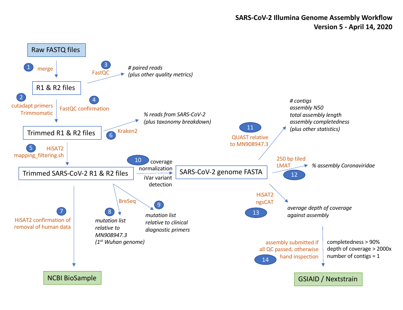

# Overview

This snakemake pipeline is compatible with the [illumina artic nf pipeline](https://github.com/connor-lab/ncov2019-artic-nf).
It performs the same consensus and variant calling procedure using `ivar`.
In addition it adds screening with Kraken2/LMAT, enhanced contamination removal, and additional breseq mutation detection.
See below for full details.

Future enhancements are intended to aid/automate metadata management in accordance with PHA4GE guidelines, and manage upload to GISAID and INDSC compatible BioSamples.

## Setup/Execution

0. Clone the git repository
    
        git clone https://github.com/jaleezyy/covid-19-sequencing

1. Install `conda` and `snakemake` (version >5) e.g.

        wget https://repo.anaconda.com/miniconda/Miniconda3-latest-Linux-x86_64.sh
        bash Miniconda3-latest-Linux-x86_64.sh # follow instructions
        source $(conda info --base)/etc/profile.d/conda.sh
        conda create -n snakemake snakemake=5.11.2
        conda activate snakemake

Additional software dependencies are managed directly by `snakemake` using conda environment files:

  - fastqc 0.11.8 ([docs](https://www.bioinformatics.babraham.ac.uk/projects/fastqc/))
  - cutadapt 1.18 ([docs](https://cutadapt.readthedocs.io/en/stable/)
  - trimmomatic 0.36 ([docs](http://www.usadellab.org/cms/?page=trimmomatic))
  - kraken2 2.0.7-beta ([docs](https://ccb.jhu.edu/software/kraken2/))
  - unicycler 0.4.8 ([github](https://github.com/rrwick/Unicycler))
  - quast 5.0.2 ([docs](http://quast.sourceforge.net/quast))
  - hisat 2.1.0 ([docs](http://daehwankimlab.github.io/hisat2/))
  - lmat, "sourceforge" version ([sourceforge](https://sourceforge.net/projects/lmat/))
  - samtools 1.7 ([docs](http://www.htslib.org/))
  - bedtools 2.26.0 ([docs](https://bedtools.readthedocs.io/en/latest/))
  - ivar 1.2 ([docs](https://github.com/andersen-lab/ivar))

2. Download necessary database files

The pipeline requires:
 
 - Amplicon primer scheme sequences (\*)
 - Nextera sequencing primer sequence files from trimmomatic 
 - SARS-CoV2 reference fasta
 - SARS-CoV2 reference gbk 
 - SARS-CoV2 reference gff3
 - kraken2 viral database
 - LMAT `kML+Human.v4-14.20.g10.db` database

All dependencies except the amplicon primers (\*) can be automatically fetched using the follow accessory script:

        bash pipeline/scripts/get_data_dependencies.sh -d data -a MN908947.3

3. Configure your `config.yaml` file

Either using the convenience python script (pending) or 
through modifying the `pipeline/example_config.yaml` to suit your system

4. Specify your samples in CSV format (e.g. `sample_table.csv`)

See the example table `pipeline/example_sample_table.csv` for an idea of how to organise this table.

5. Execute pipeline (optionally explicitly specify `--cores`):

        snakemake --use-conda -s Snakefile --cores $(nproc) all

### Docker (pending)

Alternatively, the pipeline can be deployed using Docker (see `resources/Dockerfile_pipeline` for specification).
To pull from dockerhub:

        docker pull finlaymaguire/pipeline

Download data dependencies:

        mkdir -p data && docker run -v $PWD/data:/data finlaymaguire/sars-cov2-pipeline:1.0.0 bash scripts/get_data_dependencies.sh -d /data

Add remaining files (e.g. primers) to your config and sample table in the data directory:

        cp config.yaml sample_table.csv $PWD/data && \ 
            docker run -v $PWD/data:/data finlaymaguire/sars-cov2-pipeline:1.0.0 mv data/config.yaml data/sample_table.csv .

Then execute the pipeline:

        docker run -v $PWD/data:/data finlaymaguire/sars-cov2-pipeline:1.0.0 conda run -n snakemake snakemake --use-conda --conda-prefix $HOME/.snakemake --cores 8 -s Snakefile all

## Summaries:

  - Generate summaries of BreSeq among many samples, [see](resources/dev_scripts/summaries/README.md)

## Pipeline details:

For a step-by-step walkthrough of the pipeline, see [pipeline/README.md](PIPELINE.md).

A diagram of the workflow is shown below.

